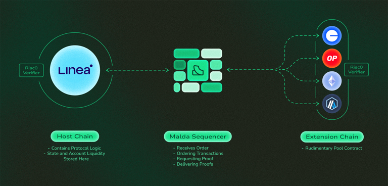

# Malda ZK Coprocessor

This repository contains the ZK coprocessor implementation for the Malda Protocol, a unified liquidity lending protocol that enables seamless cross-chain lending operations without traditional bridging. While this repository focuses on the ZK verification layer, it's part of a larger protocol architecture that includes smart contracts, the zk-coprocessor and the sequencer.



## About Malda Protocol

Malda Protocol solves the fragmentation problem in DeFi by creating a unified lending experience across multiple EVM networks. The protocol enables users to:

- Access lending markets across different L2s as if they were a single network
- Unified liquidity and interest rates across all chains
- Execute lending operations across chains without bridging or wrapping assets
- Maintain full control of their funds in a self-custodial manner


## About the ZK Coprocessor

This repository contains the ZK coprocessor, a critical component that enables Malda's cross-chain capabilities through zero-knowledge proofs. The coprocessor:

- Generates zero-knowledge proofs that verify cross-chain state and operations
- Enables trustless cross-chain communication without relying on bridges or oracles
- Provides cryptographic guarantees for cross-chain lending operations

## Table of Contents

- [Architecture](#architecture)
  - [Smart Contracts](#smart-contracts)
  - [Sequencer Infrastructure](#sequencer-infrastructure)
  - [ZK Coprocessor](#zk-coprocessor)
- [Technical Details](#technical-details)
  - [Proof Generation and Verification](#proof-generation-and-verification)
  - [Chain-Specific Verification](#chain-specific-verification)
  - [Self-Sequencing](#self-sequencing)
- [Development](#development)
  - [Prerequisites](#prerequisites)
  - [Building](#building)
  - [Testing](#testing)
- [License](#license)
- [Contributing](#contributing)
- [Security](#security)

## Architecture

### ZK Coprocessor
The core component that enables trustless cross-chain operations. It:

- Generates zero-knowledge proofs for cross-chain state verification
- Provides reorg protection for all supported chains
- Enables trustless cross-chain communication without bridges

### Other Protocol Components

The ZK coprocessor works alongside the protocol's smart contracts, which handle lending operations and state management, and the Sequencer infrastructure, which monitors events and submits proofs. Despite being centralized, the Sequencer is constrained by ZK proofs and cannot manipulate user funds, ensuring the protocol remains self-custodial. For censorship resistance, users can [generate their own proofs](#self-sequencing) if needed.

## Technical Details

### Proof Generation and Verification

The ZK coprocessor generates and verifies proofs through several key components:

#### Proof Data Generation
The `get_proof_data` functionality is central to the protocol's cross-chain operations:

1. **Guest Program**
   - Executes inside the RISC Zero zkVM
   - Verifies cross-chain state through zero-knowledge proofs
   - Validates user positions and market states across chains
   - Generates cryptographic proofs of state verification
   - Handles view calls to market contracts for state verification

#### Chain-Specific Verification

Each supported chain has specialized verification mechanisms:

1. **Ethereum (L1)**
   - Light client verification through beacon chain
   - Proof state via OPstack L1 reads

2. **Optimism/Base (OpStack)**
   - Sequencer commitment verification
   - Dispute game validation
   - L1 block inclusion proofs

3. **Linea**
   - Sequencer commitment verification
   - L1 block inclusion proofs


### Self-Sequencing

While the [Sequencer Infrastructure](#sequencer-infrastructure) handles proof generation and submission for most users, the protocol maintains censorship resistance through self-sequencing capabilities. Users can generate and submit their own proofs if:

- The Sequencer is unavailable
- The Sequencer attempts to censor transactions
- Users prefer to handle their own proof generation
- Additional security guarantees are required

#### Self-Sequencing Guide

To generate proofs independently:

1. **Setup**
   ```bash
   # Install RISC Zero zkVM and Bonsai SDK
   For detailed installation instructions, see the [RISC Zero documentation](https://dev.risczero.com/api/zkvm/install).

2. **Environment Configuration**
   Create a `.env` file with required RPC endpoints:
   ```env
   RPC_URL_LINEA=
   RPC_URL_ETHEREUM=
   RPC_URL_BASE=
   RPC_URL_OPTIMISM=
   RPC_URL_BEACON=https://www.lightclientdata.org
   # ... other chain configurations
   ```

3. **Proof Generation**
   Use the Malda SDK to generate proofs:
   ```rust
   // Using Bonsai SDK for remote proving
   pub async fn get_proof_data_prove_sdk(
       users: Vec<Vec<Address>>,
       markets: Vec<Vec<Address>>,
       target_chain_ids: Vec<Vec<u64>>,
       chain_ids: Vec<u64>,
       l1_inclusion: bool,
   ) -> Result<MaldaProveInfo, Error>

   // Using local zkVM for proving
   pub async fn get_proof_data_prove(
       users: Vec<Vec<Address>>,
       markets: Vec<Vec<Address>>,
       target_chain_ids: Vec<Vec<u64>>,
       chain_ids: Vec<Vec<u64>>,
       l1_inclusion: bool,
   ) -> Result<MaldaProveInfo, Error>
   ```

4. **Transaction Preparation**
   Extract the required data for on-chain submission:
   ```rust
   let journal = Bytes::from(proof_info.receipt.journal.bytes);
   let seal = risc0_ethereum_contracts::encode_seal(&receipt);
   ```

Note: For self-sequencing, `l1_inclusion` must be set to `true` to ensure additional security guarantees against potential reorg exploits.


## Development

### Prerequisites

- Rust toolchain
- RISC Zero toolchain
- Access to RPC endpoints for supported chains

### Building

```bash
cargo build
```

### Testing

```bash
cargo test
```

## License

This project is licensed under the Business Source License 1.1. See [LICENSE-BSL](LICENSE-BSL) for details.

## Contributing

Please read our contributing guidelines before submitting pull requests.

## Security

For security concerns, please contact the team through our security contact channels.
