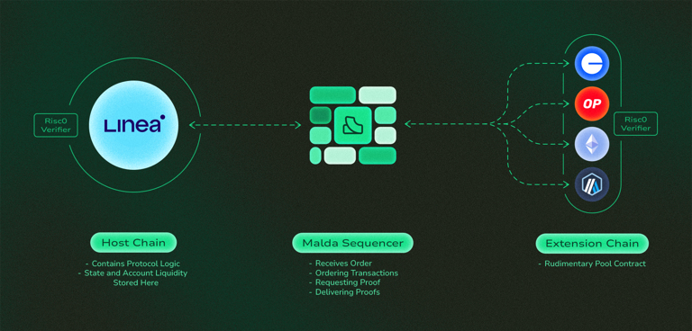

# Malda ZK Coprocessor

> **⚠️ This repository is no longer maintained by the core team. Community contributions are welcome.**

This repository contains the ZK coprocessor implementation for the Malda Protocol, a unified liquidity lending protocol that enables seamless cross-chain lending operations without traditional bridging. While this repository focuses on the ZK verification layer, it's part of a larger protocol architecture that includes smart contracts, the zk-coprocessor and the sequencer.



## Context in Malda Sequencer

The ZK Coprocessor repository is used directly by the [Malda Sequencer](https://github.com/malda-protocol/malda-sequencer) as a dependency — it serves as an SDK for generating proofs. It provides the zkVM guest program and the tooling around it, allowing the sequencer to produce and verify zero-knowledge proofs as part of its cross-chain operation flow.

## About Malda Protocol

Malda Protocol solves the fragmentation problem in DeFi by creating a unified lending experience across multiple EVM networks. The protocol enables users to:

- Access lending markets across different L2s as if they were a single network
- Unified liquidity and interest rates across all chains
- Execute lending operations across chains without bridging or wrapping assets
- Maintain full control of their funds in a self-custodial manner


## About the ZK Coprocessor

This repository contains the ZK coprocessor, a critical component that enables Malda's cross-chain capabilities through zero-knowledge proofs. The coprocessor:

- Generates zero-knowledge proofs that verify cross-chain state and operations
- Enables trustless cross-chain communication without relying on bridges or oracles
- Provides cryptographic guarantees for cross-chain lending operations

## Table of Contents

- [Architecture](#architecture)
  - [Smart Contracts](#smart-contracts)
  - [Sequencer Infrastructure](#sequencer-infrastructure)
  - [ZK Coprocessor](#zk-coprocessor)
- [Technical Details](#technical-details)
  - [Proof Generation and Verification](#proof-generation-and-verification)
  - [Chain-Specific Verification](#chain-specific-verification)
  - [Self-Sequencing](#self-sequencing)
- [Development](#development)
  - [Prerequisites](#prerequisites)
  - [Building](#building)
  - [Testing](#testing)
- [License](#license)
- [Contributing](#contributing)
- [Security](#security)

## Architecture

### ZK Coprocessor
The core component that enables trustless cross-chain operations. It:

- Generates zero-knowledge proofs for cross-chain state verification
- Provides reorg protection for all supported chains
- Enables trustless cross-chain communication without bridges

### Other Protocol Components

The ZK coprocessor works alongside the protocol's smart contracts, which handle lending operations and state management, and the Sequencer infrastructure, which monitors events and submits proofs. Despite being centralized, the Sequencer is constrained by ZK proofs and cannot manipulate user funds, ensuring the protocol remains self-custodial. For censorship resistance, users can [generate their own proofs](#self-sequencing) if needed.

## Technical Details

### Proof Generation and Verification

The ZK coprocessor generates and verifies proofs through several key components:

#### Proof Data Generation
The `get_proof_data` functionality is central to the protocol's cross-chain operations:

1. **Guest Program**
   - Executes inside the RISC Zero zkVM
   - Verifies cross-chain state through zero-knowledge proofs
   - Validates user positions and market states across chains
   - Generates cryptographic proofs of state verification
   - Handles view calls to market contracts for state verification

#### Chain-Specific Verification

Each supported chain has specialized verification mechanisms:

1. **Ethereum (L1)**
   - Light client verification through beacon chain
   - Proof state via OPstack L1 reads

2. **Optimism/Base (OpStack)**
   - Sequencer commitment verification
   - Dispute game validation
   - L1 block inclusion proofs

3. **Linea**
   - Sequencer commitment verification
   - L1 block inclusion proofs


### Self-Sequencing

While the [Sequencer Infrastructure](#sequencer-infrastructure) handles proof generation and submission for most users, the protocol maintains censorship resistance through self-sequencing capabilities. Users can generate and submit their own proofs if:

- The Sequencer is unavailable
- The Sequencer attempts to censor transactions
- Users prefer to handle their own proof generation
- Additional security guarantees are required

#### Self-Sequencing Guide

To generate proofs independently:

1. **Setup**
   ```bash
   # Install RISC Zero zkVM
   For detailed installation instructions, see the [RISC Zero documentation](https://dev.risczero.com/api/zkvm/install).
   Also to request proof in boundless market, look at the setup here: (https://docs.beboundless.xyz/developers/what).

2. **Environment Configuration**
   Create a `.env` file with required RPC endpoints:

   ```env
   # --- Mainnet RPC Endpoints ---
   RPC_URL_LINEA=<YOUR_LINEA_MAINNET_RPC_URL>
   RPC_URL_ETHEREUM=<YOUR_ETHEREUM_MAINNET_RPC_URL>
   RPC_URL_BASE=<YOUR_BASE_MAINNET_RPC_URL>
   RPC_URL_OPTIMISM=<YOUR_OPTIMISM_MAINNET_RPC_URL>
   RPC_URL_BEACON=https://www.lightclientdata.org   # Public Ethereum Beacon chain endpoint

   # --- Mainnet Fallback RPC Endpoints ---
   RPC_URL_LINEA_FALLBACK=<YOUR_LINEA_MAINNET_FALLBACK_RPC_URL>
   RPC_URL_ETHEREUM_FALLBACK=<YOUR_ETHEREUM_MAINNET_FALLBACK_RPC_URL>
   RPC_URL_BASE_FALLBACK=<YOUR_BASE_MAINNET_FALLBACK_RPC_URL>
   RPC_URL_OPTIMISM_FALLBACK=<YOUR_OPTIMISM_MAINNET_FALLBACK_RPC_URL>

   # --- Sepolia (Testnet) RPC Endpoints ---
   RPC_URL_LINEA_SEPOLIA=<YOUR_LINEA_SEPOLIA_RPC_URL>
   RPC_URL_ETHEREUM_SEPOLIA=<YOUR_ETHEREUM_SEPOLIA_RPC_URL>
   RPC_URL_BASE_SEPOLIA=<YOUR_BASE_SEPOLIA_RPC_URL>
   RPC_URL_OPTIMISM_SEPOLIA=<YOUR_OPTIMISM_SEPOLIA_RPC_URL>
   RPC_URL_LINEA_SEPOLIA_FALLBACK=<YOUR_LINEA_SEPOLIA_FALLBACK_RPC_URL>
   RPC_URL_ETHEREUM_SEPOLIA_FALLBACK=<YOUR_ETHEREUM_SEPOLIA_FALLBACK_RPC_URL>
   RPC_URL_BASE_SEPOLIA_FALLBACK=<YOUR_BASE_SEPOLIA_FALLBACK_RPC_URL>
   RPC_URL_OPTIMISM_SEPOLIA_FALLBACK=<YOUR_OPTIMISM_SEPOLIA_FALLBACK_RPC_URL>

   # --- Sequencer Commitment Endpoints (Operation Solarstorm, public) ---
   SEQUENCER_REQUEST_OPTIMISM=https://optimism.operationsolarstorm.org/latest
   SEQUENCER_REQUEST_OPTIMISM_FALLBACK=https://optimism.operationsolarstorm.org/latest
   SEQUENCER_REQUEST_BASE=https://base.operationsolarstorm.org/latest
   SEQUENCER_REQUEST_BASE_FALLBACK=https://base.operationsolarstorm.org/latest
 

   # --- ZK Prover via Boundless Market ---
   PINATA_JWT=<YOUR_PINATA_JWT>                  # Pinata JWT for IPFS uploads (if required)
   PROGRAM_URL=<YOUR_PROGRAM_URL>                # Program URL
   PRIVATE_KEY=<YOUR_PRIVATE_KEY>                # Private key for proof request on boundless market on BASE
   RPC_URL=<YOUR_RPC_URL>                        # RPC URL for BASE mainnet
   ```

3. **Proof Generation**
   Use the Malda SDK to generate proofs:
   ```rust
   // Using Boundless for remote Risc0 proving.
   // Tuple (journal, seal) is returned.
   pub async fn get_proof_data_prove_boundless_with_elf(
       users: Vec<Vec<Address>>,
       markets: Vec<Vec<Address>>,
       target_chain_ids: Vec<Vec<u64>>,
       chain_ids: Vec<u64>,
       l1_inclusion: bool,
       fallback: bool,
       onchain: bool,
       boundless_params: BoundlessParams,
       guest_elf: &[u8],
   ) -> Result<(Bytes, Bytes), Error>

   // Using local zkVM for proving - deprecated
   pub async fn get_proof_data_prove(
       users: Vec<Vec<Address>>,
       markets: Vec<Vec<Address>>,
       target_chain_ids: Vec<Vec<u64>>,
       chain_ids: Vec<Vec<u64>>,
       l1_inclusion: bool,
   ) -> Result<MaldaProveInfo, Error>
   ```

4. **Transaction Preparation**
   Extract the required data for on-chain submission:
   ```rust
   let journal = Bytes::from(proof_info.receipt.journal.bytes);
   let seal = risc0_ethereum_contracts::encode_seal(&receipt);
   ```

Note: For self-sequencing, `l1_inclusion` must be set to `true` to ensure additional security guarantees against potential reorg exploits.


## Development

### Prerequisites

- Rust toolchain
- RISC Zero toolchain
- Access to RPC endpoints for supported chains

### Building

#### Native Build

```bash
cargo build
```

By default, this compiles the Risc0 guest program. To skip the guest build:

```bash
RISC0_SKIP_BUILD=1 cargo build
```

Note: Skipping the Risc0 build results in an empty ELF with Image ID `[0, 0, 0, 0, 0, 0, 0, 0]`, which is unusable for proof generation. If you only need utilities without Risc0, better use `malda_utils` directly - it provides `cryptography`, `types`, and `validators` modules without requiring the Risc0 toolchain.

#### Building Guest ELF with Docker

The Risc0 guest program (get-proof-data) can be built using Docker:

```bash
docker build -t malda-guest-builder .
docker run malda-guest-builder
```

Running the container will display a banner with the guest ELF path and Image ID:

```
================ RISC0 Guest ELF ================
Path:      /app/target/riscv-guest/methods/guests/riscv32im-risc0-zkvm-elf/release/get-proof-data.bin
SHA256:    <hash>
Image ID:  [<image_id>]
=================================================
```

The guest ELF binary can be copied from the container for use in proof generation.
Use the path shown in the banner output:

```bash
docker cp <container_id>:<path_from_banner> ./get-proof-data.bin
```

**Note:** Reproducibility of the guest ELF can only be guaranteed by publishing the particular Docker image used for the build. This ensures that the exact build environment, toolchain versions, and dependencies are preserved.

#### Reproducible Build with Nix

The guest ELF can be built reproducibly using [Nix](https://nixos.org/) on an x86_64-linux machine. Anyone can verify the exact binary and image ID produced by CI at a given commit:

```bash
# Build the guest at a specific commit
nix build github:malda-protocol/malda-zk-coprocessor/<commit-sha>#guest

# Check the image ID
cat result/bin/get-proof-data.id

# The ProgramBinary is at result/bin/get-proof-data.bin
```

To build from a local checkout:

```bash
nix build .#guest
cat result/bin/get-proof-data.id
```

This is fully deterministic — the same commit on x86_64-linux always produces the same ELF, ProgramBinary, and image ID.

### Environment Setup for Testing

Before running tests, you must configure your environment variables. Create and fill out a `.env` file as described in the [Environment Configuration](#environment-configuration) section above. Ensure that all required RPC endpoints and `SEQUENCER_REQUEST` URLs are set for the relevant networks.

- **RPC Endpoints:** You must provide valid RPC URLs for Ethereum, Linea, Base, and Optimism (both mainnet and testnet, as needed).
- **Sequencer Commitment Endpoints:** The `SEQUENCER_REQUEST` variables for Optimism and Base must be set to enable proof data retrieval.

#### Integration Test Details

The test suite uses integration tests that interact with real contract deployments on both mainnet and testnet. This is necessary to obtain authentic Merkle proof data for proof building. However, note that tests targeting Sepolia (testnet) are marked as `ignore` by default. This is because the sequencer commitment endpoints for Optimism and Base testnets are not publicly available, making it impossible to fetch the required data for those tests.

### Testing

```bash
cargo test
```

## License

This project is licensed under the MIT License. See [LICENSE](LICENSE) for details.

## Contributing

Please read our contributing guidelines before submitting pull requests.

## Security

For security concerns, please contact the team through our security contact channels.
